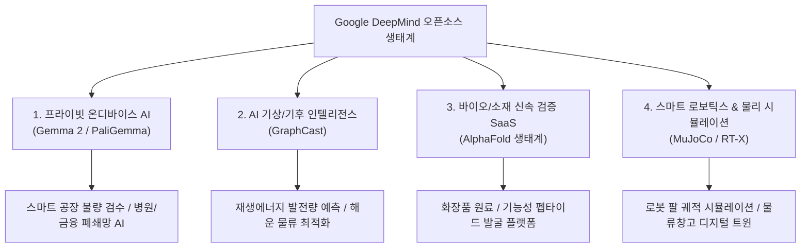
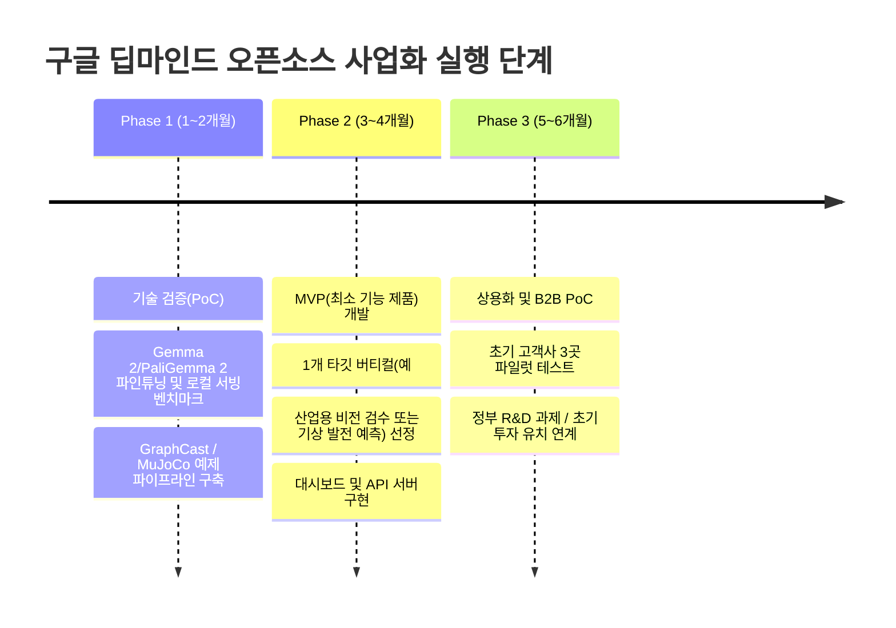

# 🧠 구글 딥마인드(Google DeepMind) 오픈소스 기반 비즈니스 모델 및 사업화 전략

> **프로젝트**: 구글 딥마인드 오픈소스 생태계 활용 상업화 기획  
> **대상 플랫폼**: Google DeepMind Open Technologies & AI Ecosystem

---

## 📌 1. 서론: 왜 딥마인드 오픈소스인가?

구글 딥마인드는 전 세계 최고 수준의 AI 연구 그룹으로, 최근 **상업적으로 즉시 활용 가능한 고성능 오픈 모델(Gemma)과 과학/산업 특화 오픈소스 프레임워크(MuJoCo, GraphCast, AlphaFold 등)**를 대거 공개하고 있습니다.

이 오픈소스들을 활용하면 **거대 클라우드 API 비용을 절감하면서도 강력한 기술 장벽을 갖춘 고부가가치 B2B/B2C 비즈니스**를 창출할 수 있습니다.

---

## 💡 2. 4대 유망 사업화 비즈니스 모델

---

### 🚀 [모델 1] 온디바이스 & 폐쇄망 특화 AI 솔루션 (실행 난이도: 보통 / 수익성: 높음)
> **핵심 기술**: `Gemma 2 (2B/9B/27B)`, `PaliGemma 2 (Vision-Language)`, `CodeGemma`

#### 🎯 타깃 시장 및 고객 페인포인트
- **의료/병원, 금융, 방산, 제조 대기업**: 데이터 보안 및 개인정보 보호 규제로 외부 퍼블릭 클라우드(ChatGPT 등) 사용 불가.
- **스마트 팩토리/엣지 장비**: 인터넷 연결이 불안정하거나 지연 시간(Latency)이 치명적인 생산 현장.

#### 💼 구체적 사업 아이템
1. **스마트 팩토리 온디바이스 비전 검수기 (PaliGemma 2 기반)**
   - 라즈베리 파이나 Mac mini / 엣지 GPU에서 카메라 영상의 결함, 불량품, 이물질을 실시간 감지 및 보고서 자동 생성.
2. **사내 폐쇄망 맞춤형 AI 지식 비서 (Gemma 2 9B + RAG)**
   - 외부 유출 없이 사내 인트라넷에 설치되는 지능형 사규 검색, 기술 문서 요약, 사내 코드 자동 생성 어플라이언스.

#### 💰 수익 모델
- 솔루션 구축비 (초기 도입비 3,000만~1억 원) + 월/연간 유지보수 및 라이선스 비용.

---

### 🌦️ [모델 2] GraphCast 기반 초정밀 기상/에너지 인텔리전스 (실행 난이도: 중상 / 마진율: 극대)
> **핵심 기술**: `GraphCast (AI 기반 10일 전 지구 기상 예측 오픈소스)`

#### 🎯 타깃 시장 및 고객 페인포인트
- **신재생에너지 발전사(태양광/풍력)**: 기상 예측 오차로 인한 전력 거래소 출력 제어 및 페널티 손실.
- **해운 및 항공 물류사**: 태풍, 악천후로 인한 항로 우회 비용 및 연료 낭비.
- **농업 법인 & 보험사**: 국지성 호우/가뭄 등 기후 리스크 사전 헷징.

#### 💼 구체적 사업 아이템
1. **태양광·풍력 발전량 예측 & 전력 입찰 자동화 SaaS**
   - GraphCast의 고해상도 풍속, 일사량, 기온 예측 데이터를 발전소 설비 데이터와 결합하여 발전량 예측 정확도 극대화.
2. **해상 최적 항로 내비게이션 솔루션**
   - 해상 기상(풍랑, 태풍 경로)을 10일 전부터 정밀 시뮬레이션하여 최단 시간/최소 연료 항로 추천.

#### 💰 수익 모델
- B2B 월간 구독료(API Call 또는 발전소 용량별 월 과금) + 발전 효율 개선분에 대한 인센티브(성공보수).

---

### 🧪 [모델 3] 바이오·기능성 소재 발굴 가속화 플랫폼 (실행 난이도: 상 / 딥테크 가치)
> **핵심 기술**: `AlphaFold 2/3 오픈 데이터베이스 & 모델 가중치`

#### 🎯 타깃 시장 및 고객 페인포인트
- **화장품, 건기식, 농약/비료, 바이오텍 중소기업**: 신약 개발이나 단백질 소재 실험 시 수억 원의 실험 비용과 수개월의 시간 소요.

#### 💼 구체적 사업 아이템
1. **기능성 펩타이드/화장품 원료 스크리닝 플랫폼**
   - 피부 흡수율, 특정 수용체 결합력이 우수한 펩타이드 서열을 AlphaFold 기반으로 사전 필터링하여 실험 비용을 1/10로 단축.
2. **식품/효소 안정성 예측 리포트 서비스**
   - 온도 변화나 산도에 강한 변이 효소 설계를 시뮬레이션하여 가공식품/발효 기업에 제공.

#### 💰 수익 모델
- 단백질 구조 분석 리포트 건당 과금 + 유망 파이프라인 공동 특허/로열티.

---

### 🤖 [모델 4] MuJoCo 기반 로봇 물리 시뮬레이터 및 디지털 트윈 (성장 잠재력: 매우 높음)
> **핵심 기술**: `MuJoCo (Multi-Joint dynamics with Contact, 딥마인드 오픈 물리엔진)`

#### 🎯 타깃 시장 및 고객 페인포인트
- **로봇 스타트업, 물류 자동화 기업**: 실제 로봇 하드웨어에 알고리즘을 올리기 전 시뮬레이션 환경 구축이 극도로 복잡하고 비용이 큼.

#### 💼 구체적 사업 아이템
1. **물류창고 AGV/로봇 매니퓰레이터 동작 시뮬레이터**
   - MuJoCo 기반으로 다양한 화물 무게, 마찰력, 충돌 상황을 사전에 100% 가상 시뮬레이션 후 최적 궤적 산출.
2. **강화학습 기반 로봇 제어 파인튜닝 SaaS**
   - 고객사가 CAD 도면을 업로드하면 자동으로 MuJoCo 물리 모델로 변환하여 제어 모터를 학습시키는 클라우드 서비스.

---

## 🏁 3. 추천 사업화 실행 로드맵 (3단계)

---

## 🛠️ 4. 바로 시작할 수 있는 기술 스택 구성

| 구분 | 추천 오픈소스 & 라이브러리 | 용도 |
|---|---|---|
| **언어 모델** | Google DeepMind `Gemma 2`, `PaliGemma 2` | 경량 텍스트/비전 인텔리전스 |
| **추론 엔진** | `vLLM`, `Ollama`, `llama.cpp` | 고속 로컬/온프레미스 서빙 |
| **과학/물리** | `MuJoCo`, `GraphCast`, `JAX/Flax` | 물리 시뮬레이션, 기후 예측 |
| **백엔드/API** | `FastAPI`, `Celery`, `PostgreSQL` | 대용량 배치 처리 및 서비스 API |
| **프론트엔드** | `Next.js` 또는 모바일 대시보드 | 직관적인 B2B 엔터프라이즈 대시보드 |
